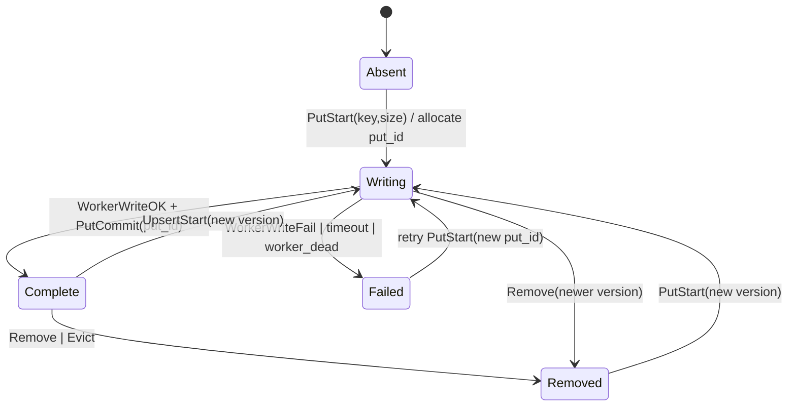
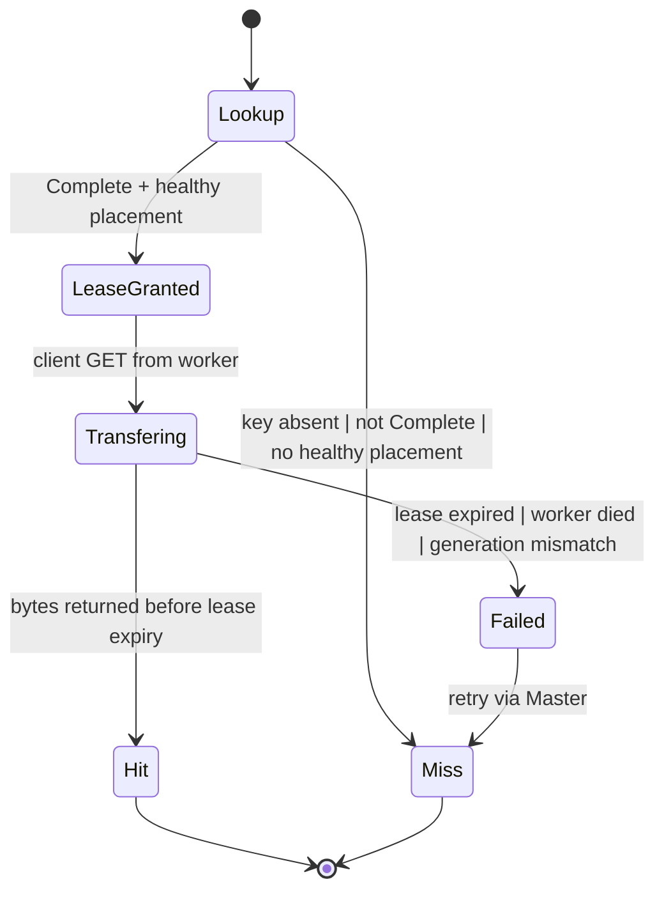
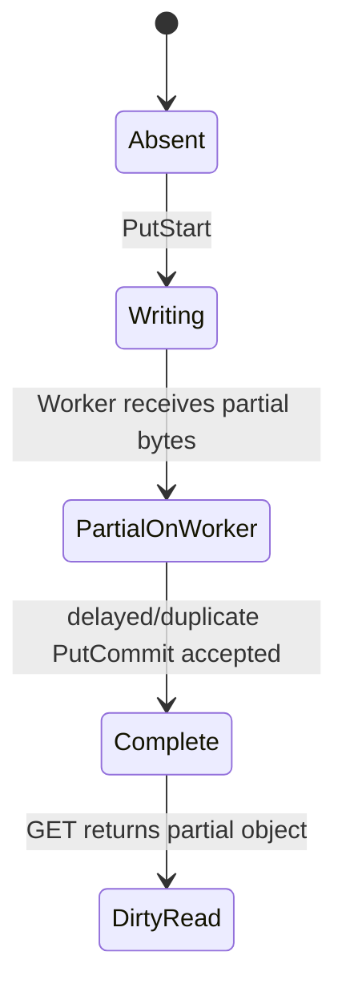
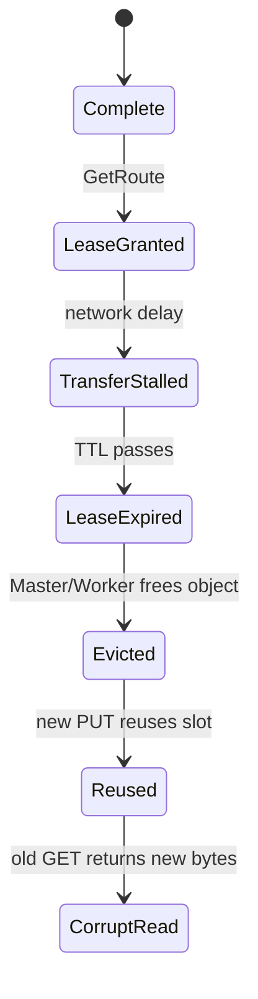
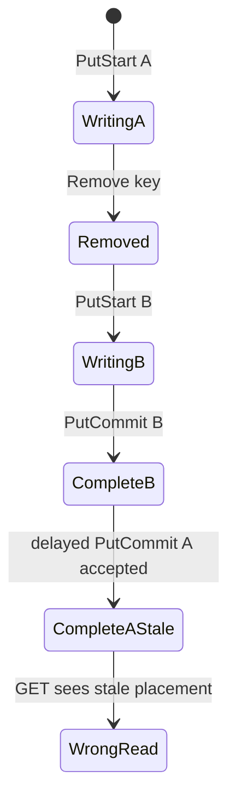
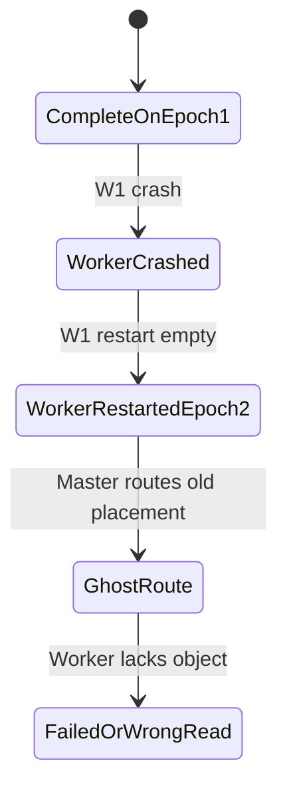

# Distributed KV Cache Storage and Scheduling for `flour` Implementation Plan

> **For agentic workers:** REQUIRED SUB-SKILL: Use `superpowers:subagent-driven-development` or `superpowers:executing-plans` to implement this plan task-by-task. Steps use checkbox syntax for tracking.

**Goal:** Extend `flour` with the simplest useful distributed KV Cache data-management layer: Master metadata + Worker object storage + GET/PUT state machines + cache-aware scheduling.

**Architecture:** Master owns only metadata: worker liveness, capacity, object state, placement, leases, and route selection. Workers own KV bytes and transfer objects directly between requester and storage Worker. The inference engine uses this layer as a remote prefix-KV object store: after prefill it PUTs reusable KV bundles; before prefill it GETs a route for an existing KV bundle and fetches it from the selected Worker.

**Tech Stack:** Rust 2021, axum, tokio, serde/serde_json, reqwest promoted from dev-dependency to runtime dependency, Candle tensors serialized through the existing KV bundle/export seam or a minimal byte-object wrapper for the first milestone.

## 1. 需求场景

### 场景：多轮长上下文聊天服务的跨节点 KV Cache 复用

`flour` 服务多个用户的长上下文多轮对话。每个请求的 prefix KV cache 很大，且不同请求经常共享相同系统提示词、RAG 文档前缀、agent 工具上下文或同一会话历史。如果每台机器只保存自己的 KV cache，会出现三个问题：

1. **单机容量不够。** KV cache 随层数、head 数、上下文长度线性增长，单个 Worker 的内存只能保留少量长上下文。
2. **调度受限。** 新请求必须调度到曾经生成过该 prefix 的同一台机器，否则要重新 prefill。
3. **重启丢缓存。** 推理 Worker 重启、滚动升级或负载迁移会导致本地 cache 消失，无法被其他节点继续复用。

所以需要开发的是一个**分布式数据管理系统**，而不是让一台机器保存所有 KV。系统管理的是 KV Cache 对象的生命周期、位置、租约、容量、读取路由和写入提交状态。

## 2. 最小系统边界

### 节点角色

* **Master**

  * 保存对象元数据。
  * 保存 Worker 注册信息、容量、心跳。
  * 分配 PUT 目标 Worker。
  * 为 GET 返回可读副本位置。
  * 不传输 KV Cache 数据。

* **Worker**

  * 保存 KV Cache 对象字节。
  * 提供 `PUT object`、`GET object`、`DELETE object`。
  * 向 Master 注册自身容量和地址。
  * 定期 heartbeat。
  * Worker 之间或 requester 与 storage Worker 之间直接传输 KV bytes。

* **Engine/Scheduler**

  * 计算 prefix key。
  * 本地 miss 时向 Master 查询 remote cache。
  * 命中后从 Worker 拉取对象。
  * 生成新的 KV bundle 后通过 Master 分配目标 Worker，再把对象写到 Worker，最后提交 Master。

## 3. 非形式化规范

### PUT 语义

`PUT(key, bytes)` 必须是两阶段的：

1. `PutStart(key, size)`：Master 选择一个 Worker，创建 `put_id`，对象状态为 `Writing`。
2. Client/Engine 直接把 bytes 写到目标 Worker。
3. `PutCommit(key, put_id)`：Master 验证 `put_id` 匹配当前写入，标记对象为 `Complete`。
4. 只有 `Complete` 对象可以被 GET 看到。

如果写入中断、Worker 崩溃、PUT 超时，Master 必须把对象转为 `Failed` 或删除对应 pending metadata。不能返回半写对象。

### GET 语义

`GET(key)` 向 Master 查询路由：

* 如果对象不存在、未完成、已过期或所在 Worker 不健康，返回 miss。
* 如果对象存在且至少一个 Worker 副本健康，返回 `{worker_id, worker_addr, lease_id, expires_at}`。
* 读者在 lease 有效期内从 Worker 拉取对象。
* Worker 必须校验对象仍存在，并且 object generation 与 lease 匹配。

### 调度语义

Scheduler 选择 decode/prefill Worker 时：

* 优先选择已有目标 prefix KV 的 Worker。
* 若命中远程 Worker，但当前推理在另一个 Worker，则先执行 remote GET，把 KV bundle 拉到当前 Worker 或直接调度到命中 Worker。
* 若 miss，则正常 prefill；prefill 完成后异步 PUT 生成的 KV bundle。
* 第一版不要求多副本；可选 `replica_count = 1`。第二版再加 best-effort replica。

## 4. 形式化规格

### 状态变量

```text
Workers:
  worker_id -> {
    addr: Url,
    capacity_bytes: Nat,
    used_bytes: Nat,
    epoch: Nat,
    last_heartbeat_ms: Time,
    status: Alive | Suspect | Dead
  }

Objects:
  key -> {
    version: Nat,
    state: Absent | Writing | Complete | Failed | Removed,
    put_id: UUID?,
    size_bytes: Nat,
    placements: Set<Placement>,
    lease_expire_ms: Time?
  }

Placement:
  {
    worker_id: WorkerId,
    worker_epoch: Nat,
    object_generation: Nat,
    state: Allocated | Stored | Deleted
  }
```

### 不变量

```text
I1: NoDirtyRead
  GET(key) may return a route only if Objects[key].state == Complete.

I2: PlacementHealth
  GET(key) may return worker w only if Workers[w].status == Alive
  and placement.worker_epoch == Workers[w].epoch.

I3: PutCommitIdempotence
  PutCommit(key, put_id) may change state to Complete only if
  Objects[key].state == Writing and Objects[key].put_id == put_id.

I4: NoABA
  A late commit from an old put_id or old object version must not modify
  a newer object version.

I5: LeaseSafety
  While a valid read lease exists, Remove/Evict must not physically free
  the selected placement, or Worker GET must fail instead of returning
  reused/corrupted bytes.

I6: CapacityAccounting
  Sum(size_bytes of live placements on worker w) <= Workers[w].capacity_bytes.
```

### PUT 状态机



### GET 状态机



## 5. 文件结构

### Create

* `src/distkv/mod.rs`

  * module root and public exports.

* `src/distkv/protocol.rs`

  * Request/response structs, IDs, object state enum, placement metadata.

* `src/distkv/master.rs`

  * In-memory Master state machine.

* `src/distkv/worker.rs`

  * In-memory Worker object store.

* `src/distkv/client.rs`

  * HTTP client used by Engine/Scheduler to call Master and Worker.

* `src/distkv/scheduler.rs`

  * Cache-aware route selection helper.

* `src/distkv/simulator.rs`

  * Deterministic model used for deep-bug search.

* `tests/distkv_integration.rs`

  * Real HTTP integration tests with one Master and two Workers.

* `docs/superpowers/plans/2026-06-23-distributed-kv-cache.md`

  * This implementation plan.

* `docs/specs/distributed-kv-cache.md`

  * User-facing system spec, invariants, and deep-bug report.

### Modify

* `src/lib.rs`

  * add `pub mod distkv;`.

* `src/main.rs`

  * add CLI role flags:

    * `--role engine|master|worker|all`
    * `--node-id`
    * `--master-url`
    * `--advertise-url`
    * `--distkv-capacity-bytes`

* `src/api/mod.rs`

  * mount Master/Worker routes when role requires them.

* `Cargo.toml`

  * move `reqwest` from dev-dependencies to dependencies.
  * optionally add `bytes = "1"` only if axum body bytes are not already available through existing deps.

* `src/engine.rs`

  * add optional `RemoteKvCacheClient`.
  * first milestone may only call `put_object` after generation and `get_object` before generation for serialized KV bundles; if tensor import/export is not ready, keep it behind a feature flag and test it with opaque bytes.

## 6. 任务计划

### Task 1: Protocol types and object states

**Files**

* Create: `src/distkv/protocol.rs`
* Create: `src/distkv/mod.rs`
* Modify: `src/lib.rs`
* Test: `src/distkv/protocol.rs`

**Interfaces**

```rust
pub type WorkerId = String;
pub type ObjectKey = String;
pub type PutId = uuid::Uuid;

#[derive(Debug, Clone, Copy, PartialEq, Eq, serde::Serialize, serde::Deserialize)]
pub enum ObjectState {
    Writing,
    Complete,
    Failed,
    Removed,
}

#[derive(Debug, Clone, serde::Serialize, serde::Deserialize)]
pub struct Placement {
    pub worker_id: WorkerId,
    pub worker_epoch: u64,
    pub object_generation: u64,
}

#[derive(Debug, Clone, serde::Serialize, serde::Deserialize)]
pub struct PutStartRequest {
    pub key: ObjectKey,
    pub size_bytes: usize,
}

#[derive(Debug, Clone, serde::Serialize, serde::Deserialize)]
pub struct PutStartResponse {
    pub put_id: PutId,
    pub worker_id: WorkerId,
    pub worker_addr: String,
    pub object_generation: u64,
}

#[derive(Debug, Clone, serde::Serialize, serde::Deserialize)]
pub struct PutCommitRequest {
    pub key: ObjectKey,
    pub put_id: PutId,
}

#[derive(Debug, Clone, serde::Serialize, serde::Deserialize)]
pub struct GetRouteResponse {
    pub key: ObjectKey,
    pub worker_id: WorkerId,
    pub worker_addr: String,
    pub object_generation: u64,
    pub lease_id: uuid::Uuid,
    pub lease_expires_ms: u64,
}
```

**Steps**

* [ ] Write serialization round-trip tests for every protocol struct.
* [ ] Run `cargo test --lib distkv::protocol`.
* [ ] Implement types.
* [ ] Re-run tests.

### Task 2: Master metadata state machine

**Files**

* Create: `src/distkv/master.rs`
* Test: `src/distkv/master.rs`

**Interfaces**

```rust
pub struct MasterState { ... }

impl MasterState {
    pub fn new(now_ms: impl Fn() -> u64 + Send + Sync + 'static) -> Self;
    pub fn register_worker(&mut self, worker_id: WorkerId, addr: String, capacity_bytes: usize) -> u64;
    pub fn heartbeat(&mut self, worker_id: &str, epoch: u64) -> anyhow::Result<()>;
    pub fn put_start(&mut self, req: PutStartRequest) -> anyhow::Result<PutStartResponse>;
    pub fn put_commit(&mut self, req: PutCommitRequest) -> anyhow::Result<()>;
    pub fn get_route(&mut self, key: &str) -> anyhow::Result<Option<GetRouteResponse>>;
    pub fn mark_worker_dead(&mut self, worker_id: &str);
}
```

**Tests**

* `put_start_creates_writing_object_not_readable`
* `put_commit_makes_object_readable`
* `late_commit_with_wrong_put_id_is_rejected`
* `get_route_skips_dead_worker`
* `capacity_accounting_rejects_when_no_worker_has_space`

**Steps**

* [ ] Write failing tests for the five behaviors above.
* [ ] Run `cargo test --lib distkv::master`.
* [ ] Implement only in-memory metadata; no HTTP yet.
* [ ] Re-run tests.

### Task 3: Worker object store

**Files**

* Create: `src/distkv/worker.rs`
* Test: `src/distkv/worker.rs`

**Interfaces**

```rust
pub struct WorkerStore { ... }

impl WorkerStore {
    pub fn new(worker_id: WorkerId, epoch: u64, capacity_bytes: usize) -> Self;
    pub fn put_bytes(&mut self, key: ObjectKey, generation: u64, bytes: Vec<u8>) -> anyhow::Result<()>;
    pub fn get_bytes(&self, key: &str, generation: u64) -> anyhow::Result<Option<Vec<u8>>>;
    pub fn delete_generation(&mut self, key: &str, generation: u64) -> anyhow::Result<()>;
    pub fn used_bytes(&self) -> usize;
}
```

**Tests**

* `put_then_get_returns_same_bytes`
* `get_with_wrong_generation_returns_none`
* `capacity_limit_rejects_large_object`
* `delete_generation_removes_only_that_generation`

**Steps**

* [ ] Write failing tests.
* [ ] Implement `WorkerStore` as `HashMap<(ObjectKey, generation), Vec<u8>>`.
* [ ] Re-run tests.

### Task 4: HTTP routes for Master and Worker

**Files**

* Modify: `src/api/mod.rs`
* Create: `src/distkv/http.rs`
* Test: `tests/distkv_integration.rs`

**Routes**

```text
POST /v1/distkv/workers/register
POST /v1/distkv/workers/heartbeat
POST /v1/distkv/put_start
POST /v1/distkv/put_commit
GET  /v1/distkv/get_route?key=<key>

PUT  /v1/distkv/worker/objects/:key?generation=<n>
GET  /v1/distkv/worker/objects/:key?generation=<n>
DELETE /v1/distkv/worker/objects/:key?generation=<n>
```

**Tests**

* Start one Master and one Worker on random local ports.
* Register Worker.
* `put_start` returns Worker route.
* Client writes bytes directly to Worker.
* `put_commit` completes metadata.
* `get_route` returns Worker route.
* Client fetches bytes directly from Worker.
* Assert Master never receives or stores bytes.

**Steps**

* [ ] Write integration test first.
* [ ] Add routers and handlers.
* [ ] Re-run `cargo test --test distkv_integration`.

### Task 5: Client and cache-aware scheduler

**Files**

* Create: `src/distkv/client.rs`
* Create: `src/distkv/scheduler.rs`
* Test: `src/distkv/client.rs`, `src/distkv/scheduler.rs`

**Interfaces**

```rust
pub struct DistKvClient {
    master_url: String,
    http: reqwest::Client,
}

impl DistKvClient {
    pub async fn put_object(&self, key: &str, bytes: Vec<u8>) -> anyhow::Result<()>;
    pub async fn get_object(&self, key: &str) -> anyhow::Result<Option<Vec<u8>>>;
}

pub struct CacheScheduler;

impl CacheScheduler {
    pub fn prefix_key(model_id: &str, token_ids: &[u32], block_size: usize) -> String;
    pub fn should_store(prompt_tokens: usize, reused_prefix_tokens: usize) -> bool;
}
```

**Policy**

* Store only if `prompt_tokens >= 2 * BLOCK_SIZE`.
* Use key format:

  * `kv://v1/model/{model_id}/prefix/{hash}/tokens/{token_count}`
* Hash includes model ID, tokenizer-sensitive token IDs, and block size.

**Tests**

* Prefix key is deterministic.
* Different model IDs produce different keys.
* `put_object` and `get_object` work through real HTTP.
* GET miss returns `Ok(None)`.

**Steps**

* [ ] Move `reqwest` to runtime dependencies.
* [ ] Write tests.
* [ ] Implement client and scheduler.
* [ ] Re-run `cargo test distkv`.

### Task 6: Engine integration behind a flag

**Files**

* Modify: `src/engine.rs`
* Modify: `src/main.rs`
* Test: `src/engine.rs`, `tests/distkv_integration.rs`

**MVP integration**

* Add optional `remote_kv: Option<DistKvClient>` to `Engine`.
* On generation start:

  * compute prompt tokens.
  * compute prefix key.
  * call `get_object`.
  * first milestone records hit/miss metrics.
* On generation end:

  * serialize a minimal KV-cache object or opaque test object.
  * call `put_object`.
* If full KV export/import is available, replace opaque bytes with actual KV bundle.

**Important constraint**

* Remote cache must be strictly optional.
* If Master/Worker is unavailable, inference must still work by falling back to local prefill.

**Tests**

* `generation_succeeds_when_master_is_down`
* `generation_puts_remote_object_after_prefill_when_enabled`
* `second_request_observes_remote_cache_hit_metric`
* Existing generation determinism tests remain unchanged.

**Steps**

* [ ] Write failing tests.
* [ ] Add CLI:

  * `--remote-kv-master-url`
  * `--remote-kv-enabled`
* [ ] Implement fallback behavior.
* [ ] Re-run `cargo test`.

### Task 7: Deep-bug simulator

**Files**

* Create: `src/distkv/simulator.rs`
* Test: `src/distkv/simulator.rs`

**Simulation events**

```rust
enum Event {
    RegisterWorker { worker: WorkerId },
    Heartbeat { worker: WorkerId, epoch: u64 },
    PutStart { key: ObjectKey, size: usize },
    WorkerWriteOk { key: ObjectKey, put_id: PutId },
    PutCommit { key: ObjectKey, put_id: PutId },
    GetRoute { key: ObjectKey },
    WorkerCrash { worker: WorkerId },
    WorkerRestart { worker: WorkerId },
    MessageDrop,
    MessageDuplicate,
    MessageDelay,
    LeaseExpire { key: ObjectKey },
    Remove { key: ObjectKey },
}
```

**Properties**

* No GET returns object in `Writing`.
* No GET returns dead Worker.
* Late commit from stale `put_id` is rejected.
* Lease expiry during transfer never returns corrupted/reused bytes.
* Worker restart with same ID but higher epoch invalidates old placements.

**Steps**

* [ ] Write deterministic scenario tests for the three deep bugs listed below.
* [ ] Add randomized event-sequence test with fixed seeds.
* [ ] Ensure every found failure has a regression test.

## 7. Deep bugs and event-state diagrams

### Deep Bug 1: Dirty read after reordered PutCommit

**Bug**
A client sends `PutStart`, writes bytes to Worker, but the Worker write is only partial or failed. Due to retry/reordered messages, `PutCommit` reaches Master and Master marks object `Complete`. A later GET returns a route to incomplete bytes.

**Why it is deep**
It requires multiple asynchronous events:

1. `PutStart` succeeds.
2. Worker write is delayed or partial.
3. `PutCommit` is duplicated or reordered.
4. Master commits without validating the current `put_id` and Worker generation.
5. GET happens after the bad commit.

**Bad transition**



**Fix**

* `PutCommit` must include `put_id`.
* Master commits only if object is still `Writing` with the same `put_id`.
* Worker write route must include `object_generation`.
* Worker GET validates generation.
* Regression test: `late_or_duplicate_commit_cannot_publish_partial_object`.

### Deep Bug 2: Lease expires during slow GET and storage is reused

**Bug**
Master grants a read lease and returns a Worker route. Network stalls. Lease expires. Master evicts the object and Worker reuses the same storage for another key. The delayed GET returns bytes from the new object.

**Why it is deep**
It requires:

1. GET route lease granted.
2. Client transfer stalls.
3. Lease expires.
4. Eviction/removal happens.
5. Storage reused.
6. Delayed GET reads stale address or stale generation.

**Bad transition**



**Fix**

* GET route includes `object_generation`.
* Worker stores by `(key, generation)`, not by raw slot alone.
* Worker returns miss/error if generation no longer exists.
* Future improvement: explicit `BeginRead/EndRead` lease refresh; MVP can fail slow GET safely.
* Regression test: `expired_lease_never_returns_reused_generation`.

### Deep Bug 3: ABA commit after remove and re-put

**Bug**
A key is written with `put_id=A`, then removed or overwritten with `put_id=B`. A delayed duplicate `PutCommit(A)` arrives after B starts or completes. If Master only checks key, it may mark the wrong generation as complete.

**Why it is deep**
It requires:

1. PUT A starts.
2. A commit is delayed.
3. Remove or PUT B changes object version.
4. Delayed commit A arrives.
5. Master mutates current key state incorrectly.

**Bad transition**



**Fix**

* Every object has monotonic `version`.
* Every write has unique `put_id`.
* `PutCommit` checks both `put_id` and current `version`.
* Regression test: `stale_put_commit_cannot_overwrite_newer_version`.

### Deep Bug 4: Worker crash/restart with same ID creates ghost placement

**Bug**
Worker `W1` stores object generation 7 and crashes. It restarts with same worker ID but empty memory. If Master does not distinguish worker epochs, GET may route to `W1` for an object that no longer exists.

**Bad transition**



**Fix**

* Worker registration increments epoch.
* Placement stores `worker_epoch`.
* GET returns placement only if `placement.worker_epoch == worker.current_epoch`.
* Regression test: `worker_restart_invalidates_old_placements`.

## 8. Quality plan

### Unit tests

* Protocol serde round trips.
* Master state transition tests.
* Worker generation validation.
* Scheduler key stability.
* Capacity accounting.

### Integration tests

* Real axum Master + two Workers.
* PUT/GET data path proves bytes bypass Master.
* Worker crash simulated by dropping Worker server and marking heartbeat timeout.
* Master returns miss instead of stale route.

### Fault-injection tests

Use `src/distkv/simulator.rs` to generate event traces with:

* message duplicate
* message drop
* message reorder
* Worker crash/restart
* delayed commit
* lease expiration
* remove during read

Every simulator failure becomes a named regression test.

### Model checking / formal validation

Add a small TLA+ or PlusCal spec under `docs/specs/distkv.tla` if time allows. Model only:

* object states
* put_id/version
* worker epoch
* GET route
* lease expiry

Check:

* `NoDirtyRead`
* `NoGhostPlacement`
* `NoABACommit`
* `LeaseSafety`

### Rust concurrency checks

For Master internals, keep state under one `Mutex<MasterState>` in MVP. If it later moves to finer-grained locks, add `loom` tests for:

* concurrent `PutCommit` and `Remove`
* concurrent `GetRoute` and worker death
* concurrent `PutStart` capacity accounting

## 9. AI Helps / open-source 使用说明

### AI 使用程度

AI 用于：

* 整理需求和规格。
* 生成实现计划。
* 提出 deep-bug 场景和测试方法。
* 生成初版代码草稿和测试草稿。

人工必须完成：

* 逐项审查代码。
* 运行测试。
* 验证状态机与规格一致。
* 检查是否引入过度设计。
* 确认 KV tensor serialization/import 不破坏模型输出。

### 开源参考

参考：

* Mooncake Store 的 Master/Client 分离、PutStart/PutEnd、元数据与数据路径分离、placement/lease 思想。
* `flour` 现有 paged KV cache、prefix reuse、OpenAI-compatible API 和 Rust/Candle 工程结构。
* `superpowers/writing-plans` 的计划格式、TDD 任务拆分和 no-placeholder 约束。

不直接复制：

* 不复制 Mooncake RDMA/Transfer Engine 代码。
* 不实现 Mooncake 的 HA Master、SSD offload、多副本、复杂 eviction。
* 不改变 `flour` 现有推理 API 的行为。

独创性工作：

* 为 `flour` 设计最小 PUT/GET 状态机。
* 设计适合课程要求的 deep-bug fault simulator。
* 把 KV Cache 作为分布式数据对象接入现有 prefix reuse 路径。
* 明确 Master 不传数据、Worker 直接传输数据的最小实现。

## 10. 验收标准

### 功能验收

* 两个 Worker 注册到一个 Master。
* Client 能 PUT 一个 KV object。
* GET 返回 Worker route。
* Client 直接从 Worker 拉取 bytes。
* Master 内存中不保存 object bytes。
* Worker crash 后 Master 不再返回该 Worker 的旧 placement。
* 远程 cache 不可用时 `flour` 仍能正常生成。

### 正确性验收

* `cargo test` 全部通过。
* deep-bug simulator 中 4 个固定 bug traces 均被防住。
* 至少 1000 条随机 fault traces 不违反核心不变量。
* 文档中包含需求场景、非形式化规范、形式化不变量、实现说明、测试和 deep-bug 报告。

### 非目标

* 不做 RDMA。
* 不做 SSD offload。
* 不做多副本强一致。
* 不做高可用 Master。
* 不做跨模型共享 KV。
* 不追求性能指标；第一版追求可解释、可测试、可证明基本安全。

## 附录：真实 KV Cache 跨节点复用（已实现）

第一版 DistKV 只把不透明 bytes（prompt token ids）写入 object store，用于验证 PUT/GET 路由与命中指标。后续里程碑实现了**真实** paged KV blocks 的导出/导入：

* `src/kv_cache/bundle.rs` 定义 `KvBundle` 与 `KvBundleCodec`（`FLKV` 魔数 + JSON header + 原始张量 bytes，支持 CPU f32/f16/bf16）。
* `Cache::export_prefix_bundle` / `import_prefix_bundle` 在 `PagedKvPool` 上读写真实 K/V，并复用 `PrefixRegistry` 的 chained `block_hash` 注册逻辑。
* `CausalLM::prefill_suffix` 只对未命中的 suffix 做 forward；`KvSession::prefill` 在拿到 mutable `Cache` 后再 GET/decode/import，导入失败安全回退到本地/冷启动。
* `KvSession::finish` 在 cache 仍被借用时导出并编码 bundle，释放 cache 锁后由 `publish_best_effort` 执行 PUT。

关键不变量：cache 只能提供 attention history，无法给出最后一个 prompt token 的 logits，所以 `reusable_token_count(prompt_len)` 取**严格小于** `prompt_len` 的最大 `BLOCK_SIZE` 倍数，至少保留 1 个 suffix token。Master/Worker 的 byte-object 语义、generation、两阶段 PUT 均保持不变。

设计细节见 [`docs/superpowers/specs/2026-06-24-real-distributed-kv-cache-design.md`](../superpowers/specs/2026-06-24-real-distributed-kv-cache-design.md)。
